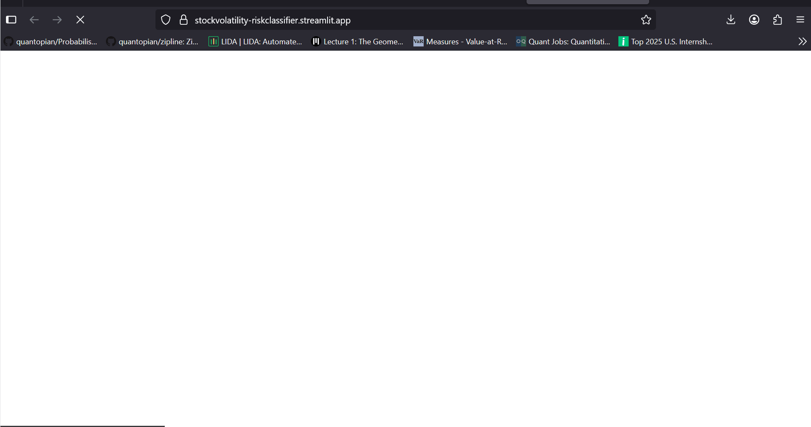

# 📉 Drawdown Risk Simulator
A lightweight, explainable financial risk assessment tool that:

- Simulates future stock price paths using **Monte Carlo methods**
- Detects **volatility regimes** via unsupervised clustering
- Estimates **short-term drawdown probabilities** using rule-based statistical heuristics

Built with **real-world market data** from **Yahoo Finance** and visualized in an **intuitive Streamlit dashboard**.

---



---

## 🔍 Features

- 📊 **Monte Carlo Simulation**: Projects possible stock price paths into the future
- 🌀 **Volatility Regime Detection**: Labels periods as "stable" or "volatile" using unsupervised clustering
- ⚠️ **Drawdown Risk Estimation**: Calculates the likelihood of significant price drops over short horizons
- 📈 **Interactive Visualization**: Streamlit + Plotly interface for exploring simulated risks and market regimes

---

## 🚀 Try It Out

> [🌐 **Live Demo** on **Streamlit Cloud**](https://stockvolatility-riskclassifier.streamlit.app)

---

## 🛠️ Tech Stack

- **Language**: **Python**
- **Libraries**: **NumPy**, **Pandas**, **yfinance**, **scikit-learn**, **Plotly**, **Streamlit**
- **Simulation**: **Geometric Brownian motion** (Monte Carlo)
- **Clustering**: **Regime detection** using **rolling volatility** and **thresholds**

---

## 🗂️ Repository Structure

| File | Description |
|------|-------------|
| `app.py` | Main Streamlit dashboard |
| `monte_carlo_sim.py` | Simulation + volatility clustering module |
| `tickers.json` | Key-value mapping of stock tickers |
| `drawdown_risk_classifier.gif` | App demo GIF (used in README) |
| `requirements.txt` | Python dependencies |

---

## 🧪 How to Run Locally

1. Clone the repo:
```bash
git clone https://github.com/<your-username>/StockVolatility-RiskClassifier.git
cd StockVolatility-RiskClassifier
```

2. Install requirements:
```bash
pip install -r requirements.txt
```

3. Launch the Streamlit app:
```bash
streamlit run app.py
```

## 📌 Example Use Case

Want to estimate the **probability of a 15% drawdown in Tesla** over the next 30 days?
This app simulates **10,000 future paths** and returns the **short-term risk**, contextualized by the **current volatility regime**.

## 🧠 Project Highlights

- Built for **practical risk assessment** using **realistic**, **interpretable logic**
- Ideal for **quant research**, **portfolio monitoring**, or **market crash detection**
- No black-box ML — model behavior is **fully explainable and parameterized**

## 📜 License

This project is licensed under the [MIT License](LICENSE).
